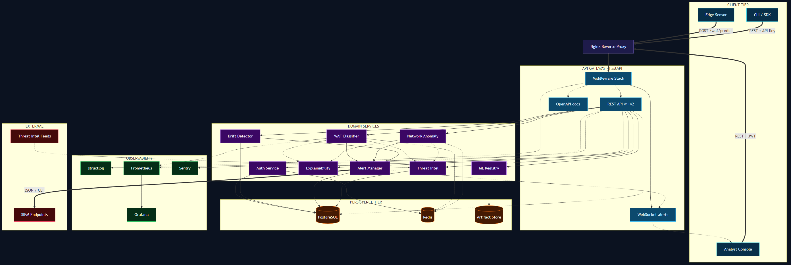
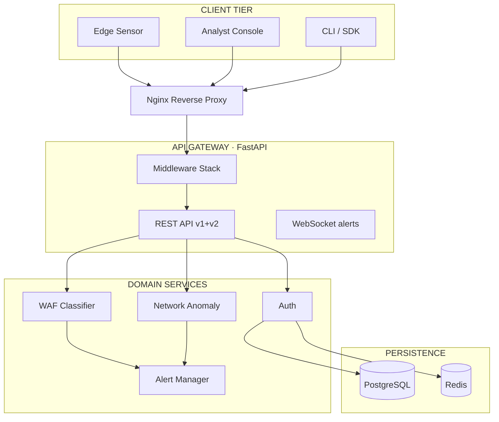

<div align="center">

# Anomaly AI

### Production-grade ML-платформа обнаружения сетевых аномалий и веб-атак

Защитно-ориентированная (defensive) платформа кибербезопасности, использующая
машинное обучение для классификации вредоносных payload и аномальных сетевых
потоков. Поставляется как полноценный monorepo: FastAPI-бэкенд, аналитическая
React-консоль, маркетинговый сайт и развёрнутая документация.

[Документация](docs/) ·
[Архитектура](docs/ARCHITECTURE.md) ·
[API](docs/API.md) ·
[План развития](docs/MEGA_PLAN.md) ·
[CHANGELOG](CHANGELOG.md)

<br>


#### Языки и среды исполнения


#### Backend — фреймворк и ORM


#### Хранилища


#### Машинное обучение


#### Аутентификация и безопасность


#### Наблюдаемость


#### Frontend — аналитическая консоль


#### Landing — маркетинговый сайт


#### DevOps и инфраструктура


#### Тестирование и качество кода


</div>

---

## Содержание

1. [О проекте](#о-проекте)
2. [Возможности версии 2.0](#возможности-версии-20)
3. [Архитектура](#архитектура)
4. [Технологический стек](#технологический-стек)
5. [Структура репозитория](#структура-репозитория)
6. [Быстрый старт](#быстрый-старт)
7. [Конфигурация](#конфигурация)
8. [API в кратком виде](#api-в-кратком-виде)
9. [Интерфейс командной строки](#интерфейс-командной-строки)
10. [Тестирование и контроль качества](#тестирование-и-контроль-качества)
11. [Развёртывание](#развёртывание)
12. [Наблюдаемость](#наблюдаемость)
13. [Безопасность и правовые аспекты](#безопасность-и-правовые-аспекты)
14. [Документация](#документация)
15. [Дорожная карта](#дорожная-карта)
16. [Вклад в проект](#вклад-в-проект)
17. [Лицензия](#лицензия)

---

## О проекте

**Anomaly AI** — это инструмент защитной аналитики, помогающий обнаруживать
вредоносные веб-payload (SQL-инъекции, XSS, обходы путей, инъекции команд) и
аномалии сетевого трафика. В основе лежат прозрачные классические ML-конвейеры
на `scikit-learn`, дополненные гибридной логикой «модель + защитные эвристики».

Проект построен как **monorepo производственного уровня** и охватывает полный
жизненный цикл: обучение, инференс, REST-API, WebSocket-стриминг алертов,
интеграцию с SIEM, журнал аудита, наблюдаемость и контейнерное развёртывание.

Главные принципы:

- **Прозрачность** — никаких «магических» цифр; метрики честно показывают то,
  что есть на демо-выборках.
- **Безопасность по умолчанию** — Argon2id, JWT с коротким TTL, rate-limit,
  audit-журнал, non-root в контейнерах.
- **Воспроизводимость** — YAML-конфигурации, фиксированные random_state,
  Alembic-миграции, мульти-стейдж сборки.
- **Расширяемость** — реестр моделей с hot-swap, плагинные SIEM-эндпоинты,
  pub/sub менеджер алертов.

---

## Возможности версии 2.0

| Область              | Реализация v1.0           | Реализация v2.0                                                            |
| -------------------- | ------------------------- | -------------------------------------------------------------------------- |
| Аутентификация       | отсутствует               | JWT (access + refresh), API-ключи `aa_live_*`, RBAC (admin/analyst/viewer) |
| База данных          | отсутствует               | SQLAlchemy 2.0 async, Alembic, PostgreSQL и SQLite                         |
| ML-модели            | TF-IDF + LR, RF           | + реестр с версионированием, drift-детектор, Isolation Forest, explain     |
| Детектор дрейфа      | отсутствует               | PSI, KS, Chi-squared с настраиваемыми порогами                             |
| Интеграции           | отсутствуют               | SIEM (JSON и CEF), Threat Intelligence, WebSocket-алерты                   |
| Наблюдаемость        | базовое logging           | structlog JSON, Prometheus, Grafana, Sentry, request-ID                    |
| Безопасность         | базовая                   | argon2, rate-limit, audit-log middleware, pre-commit, bandit               |
| Контейнеры           | dev-образ                 | multi-stage, non-root, healthchecks, nginx-runtime для фронта              |
| Оркестрация          | backend + frontend        | + Postgres, Redis, Prometheus, Grafana                                     |
| CI/CD                | smoke pytest              | ruff, mypy, bandit, pytest+coverage, pip-audit, Trivy, GHCR-релизы         |
| Документация         | 6 markdown                | + AUTH, MONITORING, INTEGRATION, DRIFT, CHANGELOG, CONTRIBUTING            |

Полный план эволюции и обоснование решений: [`docs/MEGA_PLAN.md`](docs/MEGA_PLAN.md).
История изменений: [`CHANGELOG.md`](CHANGELOG.md).

---

## Архитектура

Платформа спроектирована как набор слабосвязанных слоёв с чёткими контрактами
между ними. Все клиенты — от человеческой консоли до встраиваемых сенсоров —
обращаются к единому защищённому API-шлюзу; за ним стоят доменные сервисы,
персистентность, наблюдаемость и исходящие интеграции.

<p align="center">
  <a href="docs/architecture-diagram.png">
    
  </a>
</p>

<details>
<summary>Исходник диаграммы (Mermaid) — для правок</summary>



Полный исходник и пересборка PNG: [`docs/architecture-diagram.mmd`](docs/architecture-diagram.mmd) →
`npx -y @mermaid-js/mermaid-cli -i docs/architecture-diagram.mmd -o docs/architecture-diagram.png -b "#0b1220" -w 2800`

</details>

### Легенда диаграммы

| Слой            | Акцентный цвет | Состав                                                                              |
| --------------- | -------------- | ----------------------------------------------------------------------------------- |
| CLIENT TIER     | циан           | Edge Sensor (inline WAF-агент), Analyst Console, CLI/SDK                            |
| EDGE            | фиолетовый     | Nginx с TLS-терминацией, HSTS, gzip и статик-кэшированием                           |
| API GATEWAY     | синий          | FastAPI ядро: middleware-конвейер, REST v1+v2, WebSocket, OpenAPI                   |
| DOMAIN SERVICES | пурпурный      | Auth, WAF, Network, ML Registry, Drift, Explainability, Alert Manager, Threat Intel |
| PERSISTENCE     | оранжевый      | PostgreSQL 16, Redis 7, файловый Artifact Store с версионированием                  |
| OBSERVABILITY   | зелёный        | structlog, Prometheus, Grafana, Sentry                                              |
| EXTERNAL        | красный        | SIEM-вебхуки (Splunk HEC / ArcSight CEF / ELK), Threat Intel-фиды                   |

### Типы рёбер

- `==>` **жирная сплошная** — основной синхронный поток (HTTP-запрос, доставка алерта в SIEM).
- `-->` **тонкая сплошная** — внутренний вызов между сервисами.
- `-.->` **пунктирная** — асинхронный или фоновый поток (кэш, логи, метрики, dedup).

### Ключевые сценарии

1. **Inline WAF-скоринг.** Edge Sensor (sidecar на nginx/envoy) семплирует
   входящий HTTP-payload и шлёт `POST /api/v1/waf/predict` с `X-API-Key`. При
   `is_attack=true` и `confidence ≥ 0.85` Alert Manager публикует событие в
   WebSocket-канал и отправляет CEF/JSON в подключённые SIEM.
2. **Real-time SOC console.** Аналитик в React-консоли поднимает
   `wss://…/api/v1/alerts/ws?token=<JWT>` — все новые алерты приходят без polling.
3. **Drift-мониторинг.** Аналитик загружает свежий CSV в `POST /api/v1/drift/{module}`.
   Сервис считает PSI/KS/χ², пишет в `model_runs.drift_score`, обновляет
   Prometheus gauge `anomaly_ai_model_drift_score{module}` — Grafana и Sentry
   срабатывают на критический порог.
4. **Hot-swap модели.** Admin загружает новую версию в реестр, вызывает
   `POST /api/v1/ml/registry/{module}/promote/{version}` — следующее обращение
   к сервису поднимает новый артефакт без рестарта процесса.

Подробное описание слоёв и потоков данных: [`docs/ARCHITECTURE.md`](docs/ARCHITECTURE.md).

---

## Технологический стек

Полный визуальный обзор стека приведён в [hero-секции](#anomaly-ai) выше — там
сгруппированы все используемые библиотеки и инструменты с версиями. Ниже —
краткая текстовая сводка по доменам.

| Домен | Ключевые компоненты |
| ----- | ------------------- |
| Backend ядро | Python 3.11+, FastAPI, Uvicorn, Pydantic 2, pydantic-settings, orjson, tenacity |
| Персистентность | SQLAlchemy 2.0 async, Alembic, asyncpg, aiosqlite, PostgreSQL 16, Redis 7 |
| Машинное обучение | scikit-learn, pandas, NumPy, SciPy, joblib, CalibratedClassifierCV, IsolationForest |
| Аутентификация | passlib[argon2], PyJWT, cryptography, itsdangerous |
| Наблюдаемость | structlog, prometheus-client, sentry-sdk[fastapi], slowapi |
| Frontend (консоль) | React 19, TypeScript, Vite 8, React Router 7, Tailwind 4, Axios, Recharts |
| Landing (маркетинг) | React 19, TypeScript, Vite 8, Tailwind 4, Framer Motion 12 |
| DevOps | Multi-stage Docker, Nginx 1.27, Docker Compose v2, GitHub Actions, Vercel |
| Качество кода | pytest, ruff, mypy, bandit, pip-audit, pre-commit, gitleaks, Trivy |

---

## Структура репозитория

```text
anomaly-ai/
├── backend/                       FastAPI, ML-конвейеры, CLI, миграции, тесты
│   ├── src/anomaly_ai/
│   │   ├── api/                   Маршрутизаторы (v1 + v2), middleware, lifespan
│   │   ├── auth/                  JWT, API-ключи, RBAC, password hashing
│   │   ├── db/                    SQLAlchemy 2.0 модели, session, migrations
│   │   ├── integrations/          SIEM, Threat Intel, Alert Manager
│   │   ├── ml/                    Реестр моделей, drift, explain, calibration
│   │   ├── network_anomaly/       RandomForest + Isolation Forest
│   │   ├── observability/         structlog, Prometheus, request-ID
│   │   ├── schemas/               Pydantic-схемы
│   │   ├── services/              Артефакт-лоадер, отчёты, prediction history
│   │   └── waf_payload/           TF-IDF + LR + защитные эвристики
│   ├── migrations/                Alembic версии
│   ├── configs/                   YAML-конфигурации обучения
│   ├── data/samples/              Демонстрационные датасеты
│   ├── models/                    Joblib-артефакты
│   ├── reports/                   Отчёты метрик
│   └── tests/                     pytest-сьюты
├── frontend/                      React-консоль (страницы, hooks, API-клиент, auth)
├── landing/                       Маркетинговый сайт + встроенная документация
├── docs/                          Архитектура, API, AUTH, MONITORING, INTEGRATION, DRIFT, …
├── deploy/                        Prometheus и Grafana provisioning
├── scripts/                       vercel-build, утилиты сборки
├── .github/workflows/             backend-ci, frontend-ci, landing-ci, security, release
├── api/                           Vercel Python entrypoint
├── docker-compose.yml             Полный стек одной командой
└── vercel.json                    Конфигурация моноблочного Vercel-деплоя
```

---

## Быстрый старт

### Вариант 1. Полный стек одной командой (рекомендуется)

```bash
docker compose up --build
```

После запуска доступны:

| Сервис       | URL                       | Описание                                |
| ------------ | ------------------------- | --------------------------------------- |
| Backend API  | `http://localhost:8000`   | FastAPI + `/metrics` + `/api/swagger`   |
| Console      | `http://localhost:5173`   | Аналитическая консоль (nginx)           |
| Prometheus   | `http://localhost:9090`   | Сбор метрик                             |
| Grafana      | `http://localhost:3000`   | Дашборд с авто-провижингом (admin/admin)|
| PostgreSQL   | `localhost:5432`          | База данных                             |
| Redis        | `localhost:6379`          | Кэш и rate-limit storage                |

### Вариант 2. Локальная разработка

#### Backend

```bash
cd backend
python -m venv .venv
.venv\Scripts\Activate.ps1            # PowerShell
# source .venv/bin/activate           # bash/zsh

pip install -r requirements-dev.txt
$env:PYTHONPATH = "src"               # PowerShell
# export PYTHONPATH=src               # bash/zsh

alembic upgrade head                  # применить миграции
pytest                                # запустить тесты
uvicorn anomaly_ai.api.main:app --host 0.0.0.0 --port 8000 --reload
```

#### Frontend — консоль аналитика

```bash
cd frontend
cp .env.example .env                  # отредактируйте VITE_API_BASE_URL
npm install
npm run dev                           # http://localhost:5173
```

#### Landing — маркетинг и встроенная документация

```bash
cd landing
cp .env.example .env                  # VITE_DASHBOARD_URL, VITE_API_URL, VITE_REPO_URL
npm install
npm run dev                           # http://localhost:5174
```

---

## Конфигурация

Все настройки бэкенда задаются через переменные окружения с разумными дефолтами
для development. Шаблон со всеми параметрами и пояснениями:
[`backend/.env.example`](backend/.env.example).

Ключевые группы переменных:

| Группа          | Переменные (примеры)                                                       |
| --------------- | -------------------------------------------------------------------------- |
| Окружение       | `APP_ENV`, `DEBUG`, `LOG_LEVEL`, `LOG_JSON`                                |
| База данных     | `DATABASE_URL`, `DATABASE_POOL_SIZE`, `DATABASE_ECHO`                      |
| Кэш             | `REDIS_URL`, `CACHE_TTL_SECONDS`                                           |
| Аутентификация  | `AUTH_REQUIRED`, `JWT_SECRET`, `JWT_ACCESS_TTL_MINUTES`, `API_KEY_PREFIX`  |
| Bootstrap admin | `BOOTSTRAP_ADMIN_EMAIL`, `BOOTSTRAP_ADMIN_PASSWORD`                        |
| CORS            | `CORS_ORIGINS`                                                             |
| Rate limit      | `RATE_LIMIT_DEFAULT`, `RATE_LIMIT_AUTH`, `RATE_LIMIT_PREDICT`              |
| Наблюдаемость   | `METRICS_ENABLED`, `SENTRY_DSN`                                            |
| SIEM            | `SIEM_WEBHOOK_URL`, `SIEM_WEBHOOK_FORMAT`, `SIEM_MIN_CONFIDENCE`           |
| ML              | `ML_DRIFT_WARNING_THRESHOLD`, `ML_DRIFT_CRITICAL_THRESHOLD`                |

В режиме `AUTH_REQUIRED=false` (значение по умолчанию для dev) защищённые
эндпоинты пропускают анонимного `viewer`, что обеспечивает обратную
совместимость с демонстрационным режимом фронтенда.

---

## API в кратком виде

Полная справка по контрактам — в [`docs/API.md`](docs/API.md) и интерактивной
Swagger-документации по адресу `http://localhost:8000/api/swagger`.

### Здоровье и метаданные

```bash
curl http://localhost:8000/health
curl http://localhost:8000/health/ready
curl http://localhost:8000/api/v1/info
curl http://localhost:8000/metrics
```

### Предсказания — v1, обратно совместимы

```bash
curl -X POST http://localhost:8000/api/v1/waf/predict \
     -H "Content-Type: application/json" \
     -d "{\"payload\":\"id=1' OR '1'='1\"}"

curl -X POST http://localhost:8000/api/v1/network/upload-csv \
     -F "file=@backend/data/samples/sample_network_flows.csv"
```

### Аутентификация — v2

```bash
curl -X POST http://localhost:8000/api/v1/auth/login \
     -H "Content-Type: application/json" \
     -d '{"email":"admin@anomaly.local","password":"ChangeMe!2026"}'

curl -X POST http://localhost:8000/api/v1/auth/api-keys \
     -H "Authorization: Bearer <ACCESS_TOKEN>" \
     -H "Content-Type: application/json" \
     -d '{"name":"splunk-export","scopes":"predict"}'
```

### Расширенные модули — v2

| Метод | Путь                                          | Назначение                                          |
| ----- | --------------------------------------------- | --------------------------------------------------- |
| GET   | `/api/v1/admin/audit`                         | Журнал аудита с пагинацией                          |
| GET   | `/api/v1/alerts`                              | REST-список алертов                                 |
| WS    | `/api/v1/alerts/ws`                           | WebSocket-стрим живых алертов                       |
| POST  | `/api/v1/drift/{module}`                      | Расчёт PSI/KS/Chi² по CSV                           |
| GET   | `/api/v1/ml/registry/{module}`                | Список версий модели                                |
| POST  | `/api/v1/ml/registry/{module}/promote/{ver}`  | Hot-swap активной версии                            |
| POST  | `/api/v1/integrations/siem`                   | Регистрация SIEM-эндпоинта                          |
| POST  | `/api/v1/integrations/threat-intel/lookup`    | Поиск IOC в базе Threat Intel                       |

---

## Интерфейс командной строки

```bash
cd backend
$env:PYTHONPATH = "src"

# Обучение WAF-классификатора
python -m anomaly_ai.waf_payload.train --config configs/waf_payload.yaml

# Обучение детектора сетевых аномалий
python -m anomaly_ai.network_anomaly.train --config configs/network_anomaly.yaml

# Одиночное предсказание payload
python -m anomaly_ai.waf_payload.predict --payload "id=1' OR '1'='1"

# Пакетное предсказание сетевых потоков
python -m anomaly_ai.network_anomaly.predict \
       --model models/network_anomaly_model.joblib \
       --input data/samples/sample_network_flows.csv
```

Демонстрационные данные находятся в [`backend/data/samples/`](backend/data/samples/).
Они предназначены **исключительно** для проверки конвейера; на них нельзя строить
производственные выводы. Подробности — [`docs/DATASETS.md`](docs/DATASETS.md) и
[`docs/MODEL_CARD.md`](docs/MODEL_CARD.md).

---

## Тестирование и контроль качества

```bash
cd backend
$env:PYTHONPATH = "src"

ruff check src tests                  # линтер
ruff format src tests                 # автоформат
mypy src                              # типизация
bandit -c pyproject.toml -r src       # security-сканер
pytest --cov=anomaly_ai               # тесты с покрытием
pip-audit -r requirements.txt         # известные CVE
```

Целевые показатели: покрытие тестами ≥ 80%, отсутствие HIGH/CRITICAL находок в
bandit и pip-audit, нулевые предупреждения ruff в `src/`.

Hooks устанавливаются через `pre-commit install` и запускаются автоматически
перед каждым коммитом — см. [`.pre-commit-config.yaml`](.pre-commit-config.yaml).

---

## Развёртывание

### Docker Compose (рекомендуется для self-hosted)

```bash
docker compose up --build -d
docker compose logs -f anomaly-ai-backend
docker compose down
```

Тома `postgres-data`, `redis-data`, `prometheus-data`, `grafana-data`
обеспечивают сохранность данных между рестартами. Конфигурация Prometheus и
дашборд Grafana авто-провижатся из каталога [`deploy/`](deploy/).

### Vercel (моноблочный публичный деплой)

В корне репозитория уже подготовлены [`vercel.json`](vercel.json),
[`api/index.py`](api/index.py) и [`scripts/vercel-build.mjs`](scripts/vercel-build.mjs).
Импортируйте репозиторий в Vercel и нажмите Deploy — менять Root Directory,
Build Command или переменные окружения не требуется.

После выкладки на одном домене работают:

| Маршрут       | Назначение                                                              |
| ------------- | ----------------------------------------------------------------------- |
| `/`           | Маркетинговый лендинг                                                   |
| `/docs/*`     | Встроенная техническая документация (SPA)                               |
| `/console/*`  | Аналитическая консоль (SPA, basename настроен под префикс)              |
| `/health`     | Healthcheck FastAPI                                                     |
| `/api/v1/*`   | REST API                                                                |
| `/api/swagger`| Интерактивная OpenAPI                                                   |

Полный гайд по сценариям локального, контейнерного и serverless-запуска:
[`docs/DEPLOYMENT.md`](docs/DEPLOYMENT.md). Замечания по cold-start с
scikit-learn в serverless приведены там же.

---

## Наблюдаемость

- **Структурированные логи.** `structlog` → JSON в production (`LOG_JSON=true`),
  читабельный ANSI в dev. Каждое сообщение содержит `request_id`, прокидываемый
  из заголовка `X-Request-ID`.
- **Метрики.** `prometheus-client` экспортирует HTTP-счётчики, гистограммы
  латентности, счётчики предсказаний, gauge дрейфа моделей, метрики попыток
  логина и сгенерированных алертов. Эндпоинт: `GET /metrics`.
- **Дашборды.** В Grafana авто-провижится дашборд «Anomaly AI — Overview»
  с панелями RPS, p95 латентности, drift score и количества алертов.
- **Трассировка ошибок.** Опциональная интеграция Sentry (`SENTRY_DSN`).
- **Healthchecks.** `/health`, `/health/live` (liveness), `/health/ready`
  (readiness — проверка БД).

Полный каталог метрик и примеры PromQL: [`docs/MONITORING.md`](docs/MONITORING.md).

---

## Безопасность и правовые аспекты

Anomaly AI предназначен **исключительно** для защитного применения: образования,
исследований, портфолио и анализа данных, на которые у вас есть права. **Не
используйте** платформу для несанкционированных атак, сканирования или обхода
средств защиты третьих сторон.

Реализованные защитные практики:

- Argon2id для хэширования паролей (OWASP-рекомендованный)
- JWT с коротким TTL и серверным отзывом refresh-токенов
- API-ключи: хранится только SHA-256 хэш, plain показывается один раз
- RBAC и обязательная авторизация при `AUTH_REQUIRED=true`
- Audit-журнал каждого API-вызова
- Rate-limit на основе IP с настраиваемыми политиками
- Non-root пользователь в Docker-образах, healthchecks
- Bandit и gitleaks в pre-commit, Trivy и pip-audit в CI

Модель угроз и политика раскрытия уязвимостей: [`SECURITY.md`](SECURITY.md).
Модель безопасности и аутентификации: [`docs/AUTH.md`](docs/AUTH.md).

---

## Документация

Полная документация находится в каталоге [`docs/`](docs/) и состоит из тематических документов:

| Документ                                          | Содержание                                                    |
| ------------------------------------------------- | ------------------------------------------------------------- |
| [`MEGA_PLAN.md`](docs/MEGA_PLAN.md)               | Master-план эволюции платформы (6 фаз)                        |
| [`ARCHITECTURE.md`](docs/ARCHITECTURE.md)         | Архитектурные слои и потоки данных                            |
| [`API.md`](docs/API.md)                           | Полная справка по REST-эндпоинтам                             |
| [`AUTH.md`](docs/AUTH.md)                         | Модель безопасности: JWT, API-ключи, RBAC                     |
| [`MONITORING.md`](docs/MONITORING.md)             | Prometheus-метрики, Grafana, structlog                        |
| [`INTEGRATION.md`](docs/INTEGRATION.md)           | SIEM (JSON/CEF) и Threat Intelligence                         |
| [`DRIFT.md`](docs/DRIFT.md)                       | Детектор дрейфа: PSI, KS, Chi-squared                         |
| [`DATASETS.md`](docs/DATASETS.md)                 | Форматы данных, демонстрационные выборки и их ограничения     |
| [`MODEL_CARD.md`](docs/MODEL_CARD.md)             | Назначение моделей, ограничения, этика                        |
| [`DEPLOYMENT.md`](docs/DEPLOYMENT.md)             | Сценарии локального, контейнерного и serverless-запуска       |
| [`ROADMAP.md`](docs/ROADMAP.md)                   | Дорожная карта релизов                                        |
| [`CHANGELOG.md`](CHANGELOG.md)                    | История изменений в формате Keep a Changelog                  |
| [`CONTRIBUTING.md`](CONTRIBUTING.md)              | Гайдлайны разработки                                          |
| [`CODE_OF_CONDUCT.md`](CODE_OF_CONDUCT.md)        | Contributor Covenant 2.1                                      |
| [`SECURITY.md`](SECURITY.md)                      | Модель угроз и политика disclosure                            |

---

## Дорожная карта

Краткий обзор приоритетов на ближайшие релизы:

- **v2.1** — расширенная Threat Intelligence (STIX/TAXII), геокарта угроз в консоли.
- **v2.2** — фоновые задачи на `arq` (Redis-based очередь), генерация отчётов по расписанию.
- **v2.3** — i18n (RU/EN/UZ), расширенные visualизации (heatmap, confusion matrix, drift timeline).
- **v2.4** — federated-обучение по нескольким развёрнутым инстансам.
- **v3.0** — production-мониторинг с авто-переобучением и canary-деплоем моделей.

Полный список и обоснование: [`docs/ROADMAP.md`](docs/ROADMAP.md) и
[`docs/MEGA_PLAN.md`](docs/MEGA_PLAN.md).

---

## Вклад в проект

Pull-request и issue приветствуются. Перед отправкой PR:

1. Ознакомьтесь с [`CONTRIBUTING.md`](CONTRIBUTING.md) и [`CODE_OF_CONDUCT.md`](CODE_OF_CONDUCT.md).
2. Убедитесь, что `ruff check`, `mypy`, `pytest` и `bandit` проходят локально.
3. Используйте формат Conventional Commits: `feat:`, `fix:`, `docs:`, `test:`, …
4. В описании PR опишите **что** изменено и **зачем**, со ссылкой на issue.

---

## Лицензия

Распространяется под лицензией [MIT](LICENSE). Свободное использование, изменение
и распространение разрешены при сохранении исходного уведомления об авторских правах.

---

<div align="center">

Сделано с уважением к защитной кибербезопасности.<br>
Используйте только на данных, на которые у вас есть права.

</div>
