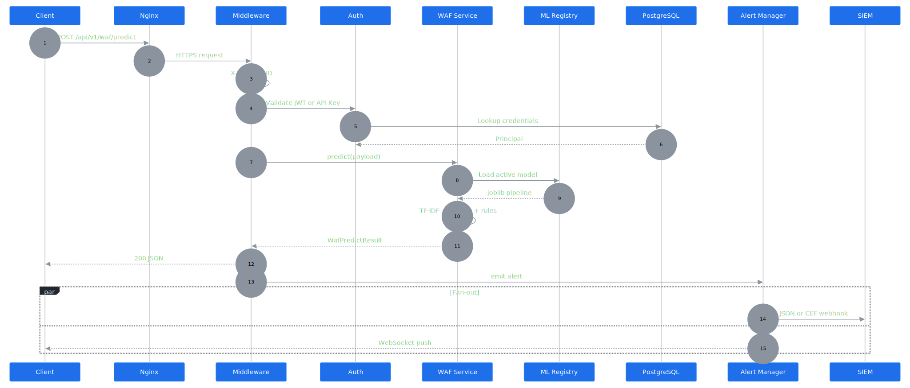

# Архитектура

> Этот документ описывает системную архитектуру **Anomaly AI v2.0** — от
> высокоуровневых слоёв до контрактов между модулями и сценариев отказов.
> Целевая аудитория: инженеры, проектирующие интеграцию, и SRE, эксплуатирующие
> платформу в production.

## Содержание

1. [Принципы проектирования](#принципы-проектирования)
2. [Высокоуровневая диаграмма](#высокоуровневая-диаграмма)
3. [Слой за слоем](#слой-за-слоем)
4. [Поток запроса: predict → alert → SIEM](#поток-запроса-predict--alert--siem)
5. [Модель данных](#модель-данных)
6. [Контракты между слоями](#контракты-между-слоями)
7. [Конкурентность и потокобезопасность](#конкурентность-и-потокобезопасность)
8. [Деградация и отказоустойчивость](#деградация-и-отказоустойчивость)
9. [Эволюция и обратная совместимость](#эволюция-и-обратная-совместимость)
10. [Связанные документы](#связанные-документы)

---

## Принципы проектирования

Архитектура подчинена пяти принципам.

| Принцип | Воплощение |
| --- | --- |
| Defensive-only | Никаких exploit-генераторов; правила и эвристики — только классификаторы |
| Прозрачность | Каждая модель имеет model card; метрики честны (могут быть нулями на чистой инсталляции) |
| Слабая связанность | Слои общаются через явные контракты (Pydantic + ORM + сервисные интерфейсы) |
| Безопасность по умолч. | argon2id, JWT с коротким TTL, RBAC, audit-log, rate-limit, non-root в контейнерах |
| Воспроизводимость | YAML-конфиги, фиксированный `random_state`, Alembic-миграции, multi-stage сборки |

---

## Высокоуровневая диаграмма

<p align="center">
  <a href="diagrams/architecture-layers.svg">
    
  </a>
</p>

Полная схема с Clients, Gateway middleware и всеми сервисами — в корневом
[`README.md`](../README.md#архитектура) (`diagrams/architecture-overview.svg`).

---

## Слой за слоем

### 1. Edge / Reverse Proxy

**Технология:** Nginx 1.27 (alpine), либо облачный балансировщик с TLS.

**Обязанности:**

- TLS-терминация (Let's Encrypt / cert-manager / cloud).
- `Strict-Transport-Security`, `X-Content-Type-Options`, `X-Frame-Options`.
- gzip / brotli сжатие ответов.
- Статика консоли (`/console/*`) и лендинга (`/`) — `try_files $uri /index.html`.
- Проксирование `/api/v1/*`, `/health`, `/metrics`, WebSocket → backend.
- Прокидывание `X-Forwarded-For`, `X-Real-IP` — backend использует их для
  rate-limit и audit-логов.

### 2. API Core — FastAPI

**Технология:** Python 3.11, FastAPI, Uvicorn (с `--proxy-headers`).

**Middleware-стек** (порядок важен):

```python
app.add_middleware(RequestIdMiddleware)       # 1. X-Request-ID в контекст
app.add_middleware(PrometheusMiddleware)      # 2. RPS, латентность
app.add_middleware(CORSMiddleware, ...)       # 3. CORS
app.add_middleware(AuditLogMiddleware)        # 4. Запись в audit_logs (async)
# SlowAPI как ExceptionHandler (через декораторы на роуты)
```

**Lifespan:**

- На старте: `create_engine()`, `init_db()` (только dev/test), `_bootstrap_admin()`.
- На остановке: `engine.dispose()`, закрытие WebSocket-соединений.

### 3. Domain Services

| Сервис | Файл | Назначение |
| --- | --- | --- |
| Auth | [`auth/`](../backend/src/anomaly_ai/auth/) | JWT, API-keys, RBAC, password hashing |
| WAF Classifier | [`waf_payload/service.py`](../backend/src/anomaly_ai/waf_payload/service.py) | TF-IDF + LR + защитные правила |
| Network Anomaly | [`network_anomaly/service.py`](../backend/src/anomaly_ai/network_anomaly/service.py) | RF + Isolation Forest |
| ML Registry | [`ml/registry.py`](../backend/src/anomaly_ai/ml/registry.py) | Файловый реестр моделей с hot-swap |
| Drift Detector | [`ml/drift.py`](../backend/src/anomaly_ai/ml/drift.py) | PSI, KS, χ² |
| Explainability | [`ml/explain.py`](../backend/src/anomaly_ai/ml/explain.py) | Top n-грамм, feature importances |
| Alert Manager | [`integrations/alert_manager.py`](../backend/src/anomaly_ai/integrations/alert_manager.py) | In-memory pub/sub + SIEM dispatcher |
| SIEM Dispatcher | [`integrations/siem.py`](../backend/src/anomaly_ai/integrations/siem.py) | JSON (Splunk HEC) и CEF (ArcSight) с retry |
| Threat Intel | [`integrations/threat_intel.py`](../backend/src/anomaly_ai/integrations/threat_intel.py) | CRUD индикаторов, CSV-импорт, lookup |

### 4. Persistence

**PostgreSQL 16** (SQLite + aiosqlite в dev/test).

| Таблица                | Назначение                                                            |
| ---------------------- | --------------------------------------------------------------------- |
| `users`                | Учётки аналитиков, роли, хэш пароля (argon2id), `last_login_at`        |
| `refresh_tokens`       | Серверные refresh JWT (для revocation)                                 |
| `api_keys`             | Хранится только SHA-256 хэш; prefix для UI; scopes, expires_at         |
| `predictions`          | Журнал предсказаний с input_hash для дедупликации                      |
| `audit_logs`           | Каждый завершённый HTTP-запрос                                         |
| `alerts`               | Сгенерированные алерты со статусами (new/ack/closed/false_positive)   |
| `model_runs`           | История обучений + drift_score + статус                               |
| `siem_endpoints`       | Зарегистрированные SIEM-вебхуки                                        |
| `threat_intel_entries` | Локальная база IOC                                                    |

**Redis 7** — опциональный, но рекомендуется в production:

- Хранение rate-limit счётчиков (`slowapi` storage).
- Дедупликация предсказаний по `sha256(payload)` с TTL = `CACHE_TTL_SECONDS`.
- Кэш user → permissions (для холодных холодных стартов FastAPI workers).

**Artifact Store** — файловая система, структура:

```text
backend/models/
├── waf_payload/
│   ├── 1.0.0/
│   │   ├── artifact.joblib       # сериализованный sklearn Pipeline + метаданные
│   │   └── metadata.json          # metrics, training_samples, created_at
│   ├── 1.1.0/
│   │   ├── artifact.joblib
│   │   └── metadata.json
│   └── ACTIVE                    # plain-text файл с активной версией
└── network_anomaly/
    └── ...
```

При `POST /api/v1/ml/registry/{module}/promote/{version}` файл `ACTIVE`
переписывается атомарно; `_waf_service_cached.cache_clear()` сбрасывает
in-process кэш; следующее обращение загружает новую модель.

### 5. Observability

Подробности — в [`MONITORING.md`](MONITORING.md). Кратко:

- **structlog** → JSON в `stdout` (production) или ANSI (dev).
- **Prometheus** `/metrics` — 9 семейств метрик: HTTP, predictions, drift, auth, alerts.
- **Grafana** — авто-провижится из [`deploy/grafana/`](../deploy/grafana/).
- **Sentry** (опц.) — backtraces ошибок + 10% traces.

### 6. External Egress

- **SIEM** — JSON (Splunk HEC, ELK, Datadog) и CEF (ArcSight, QRadar).
- **Threat Intel feeds** — STIX/TAXII (v2.1+), CSV-импорт уже работает.

---

## Поток запроса: predict → alert → SIEM

<p align="center">
  <a href="diagrams/predict-flow.svg">
    
  </a>
</p>

---

## Модель данных

<p align="center">
  <a href="diagrams/data-model.svg">
    
  </a>
</p>

Полные ORM-определения: [`backend/src/anomaly_ai/db/models.py`](../backend/src/anomaly_ai/db/models.py).

---

## Контракты между слоями

### REST API ↔ Frontend

- **Сериализация** — Pydantic v2 (`BaseModel` со `model_config`).
- **Ошибки** — единый формат `{"error": "<code>", "message": "<rus>"}`.
- **Заголовки** — каждый ответ содержит `X-Request-ID`.
- **Версионирование** — `/api/v1/*` (стабильное), `/api/v2/*` (breaking changes).

### Сервисный слой ↔ ORM

- ORM-модели импортируются только в сервисах и роутерах.
- Pydantic-схемы (`schemas/`) для request/response.
- Никаких leaky abstractions: роутеры не знают про SQLAlchemy типы.

### ML Service ↔ Artifact

- Артефакт = `dict` с обязательными ключами: `project`, `model`, `features`,
  `labels`, `model_type`, `version`, `created_at`, `metrics`.
- Загрузчик ([`services/artifact_loader.py`](../backend/src/anomaly_ai/services/artifact_loader.py))
  валидирует структуру и кидает `ModelArtifactError` если что-то не так.

### Alert Manager ↔ Подписчики

- In-memory `asyncio.Queue(maxsize=100)` на каждого WS-подписчика.
- Backpressure: при переполнении событие в этого подписчика теряется
  (логируется `alert.subscriber_queue_full`) — SIEM получает событие в любом случае.

---

## Конкурентность и потокобезопасность

- **ML-сервисы кэшируются через `@lru_cache`** в
  [`api/dependencies.py`](../backend/src/anomaly_ai/api/dependencies.py).
  Один inference-pipeline на процесс. sklearn pipeline thread-safe для inference.
- **WSGI/ASGI** — Uvicorn запускается с `--workers=N`; каждый worker = отдельный
  процесс с собственным кэшем модели и пулом DB.
- **ML Registry** — `threading.RLock` вокруг `activate()`. Запись `ACTIVE`
  атомарна (POSIX rename внутри `pathlib.Path.write_text` в реальности
  не атомарна; для строгой атомарности на nfs/k8s рассмотреть `os.rename`
  через временный файл — TODO).
- **AuditLog** — пишется в `asyncio.create_task` (fire-and-forget), не блокирует
  ответ клиенту.
- **Prediction History** (`services/prediction_history.py`) — `collections.deque`
  с `threading.Lock`.

---

## Деградация и отказоустойчивость

| Сбой | Поведение системы |
| --- | --- |
| БД недоступна | `/health/ready` → `degraded`. Audit/predict-запись падает gracefully (лог + 500 на write). |
| Redis недоступен | Rate-limit падает в in-memory режим. Кэш дедупликации отключён. |
| ML артефакт отсутствует | Эндпоинт возвращает 503 `ModelNotFoundError` с понятным message. |
| ML артефакт повреждён | 500 `ModelArtifactError` (валидация ключей в `load_artifact`). |
| SIEM-вебхук таймаут | До 3 retry с экспоненциальной задержкой; финальный failure логируется, ответ клиенту не страдает. |
| WebSocket-подписчик отвалился | `on_disconnect` → `alert_manager.unsubscribe`. Очередь подписчика очищается. |
| Cold start на Vercel | Lifespan пропускает БД (`is_serverless=True`). ML-модель грузится при первом запросе. |

---

## Эволюция и обратная совместимость

- **API v1 заморожен.** Контракты v1.0 сохраняются 1:1. Новые поля могут
  добавляться, но только как **optional** в response.
- **API v2** — для breaking changes.
- **Миграции БД** — только additive в minor-релизах. Удаление колонок —
  через двухфазную миграцию (deprecate → release → drop).
- **Артефакты моделей** — schema versioned через `model_type` и `version`
  в metadata. Старые версии остаются доступны через registry до явного
  удаления.

---

## Связанные документы

- [`API.md`](API.md) — справочник REST/WebSocket эндпоинтов.
- [`AUTH.md`](AUTH.md) — модель безопасности и аутентификации.
- [`MONITORING.md`](MONITORING.md) — метрики, дашборды, алертинг.
- [`INTEGRATION.md`](INTEGRATION.md) — SIEM и Threat Intelligence.
- [`DRIFT.md`](DRIFT.md) — детектор дрейфа.
- [`DATASETS.md`](DATASETS.md) — форматы данных, подготовка.
- [`MODEL_CARD.md`](MODEL_CARD.md) — карточки моделей.
- [`DEPLOYMENT.md`](DEPLOYMENT.md) — сценарии развёртывания.
- [`MEGA_PLAN.md`](MEGA_PLAN.md) — план эволюции платформы.
