# Anomaly AI v2.0 — MEGA-план эволюции платформы

> Этот документ описывает превращение учебно-портфолиоьного MVP в **production-grade ML-платформу обнаружения киберугроз**. План разбит на 6 фаз; каждая фаза самодостаточна и может быть выпущена как минорная версия.

---

## 0. Контекст и цели

**Текущее состояние (v1.0):**

- FastAPI с двумя ML-конвейерами (WAF: TF-IDF + LogReg, Network: MinMaxScaler + RandomForest).
- React 19 консоль с демо-режимом по умолчанию.
- Лендинг и встроенные docs на Framer Motion.
- Развёртывание: Docker Compose + Vercel-моноблок.
- Нет аутентификации, базы данных, наблюдаемости, фоновых задач, SIEM-интеграций.

**Цели MEGA-апгрейда:**

1. **Безопасность доступа** — JWT, API-ключи, RBAC (admin/analyst/viewer).
2. **Персистентность** — SQLAlchemy 2.0 + PostgreSQL (SQLite для dev) + Alembic.
3. **Наблюдаемость** — структурированные JSON-логи (structlog), Prometheus-метрики, OpenTelemetry-стаб, готовность/живость.
4. **Расширенный ML** — реестр моделей, детектор дрейфа (PSI/KS), Isolation Forest (unsupervised), калибровка, объяснимость.
5. **Интеграции** — SIEM-вебхуки (CEF + JSON), Threat Intelligence (кэш репутации IP/хэшей).
6. **Реальное время** — WebSocket для живых алертов, очередь фоновых задач.
7. **Производственный UX** — страницы логина, админ-панель пользователей, журнал аудита, переключатель тем, карта угроз.
8. **Безопасность кода** — pre-commit, ruff/mypy/bandit/safety в CI, SBOM, security-сканирование контейнеров.

---

## 1. Фаза 1 — Фундамент (v1.5)

### 1.1 База данных

- **SQLAlchemy 2.0** (async-движок `asyncpg` для Postgres, `aiosqlite` для dev).
- **Alembic** миграции в `backend/migrations/`.
- Базовые таблицы:
  - `users` — id, email, hashed_password, role, is_active, created_at.
  - `api_keys` — id, user_id, prefix, hashed_key, name, scopes, expires_at, revoked_at.
  - `predictions` — id, user_id, module, input_hash, payload_preview, prediction, confidence, severity, created_at.
  - `audit_logs` — id, user_id, action, resource, ip, user_agent, status_code, request_id, created_at.
  - `alerts` — id, severity, module, summary, payload, prediction_id, status (new/ack/closed), created_at, ack_by.
  - `model_runs` — id, model_type, version, metrics_json, drift_score, created_at.

### 1.2 Аутентификация и авторизация

- **JWT** access-токены (15 мин) + refresh-токены (7 дней, persist в БД).
- **API-ключи** для машин-к-машине (формат `aa_live_<32_random>`, хранится только хэш).
- **Хэширование паролей**: argon2 (через `passlib[argon2]`).
- **RBAC**: декоратор `require_role("admin")` поверх FastAPI-зависимости.
- Эндпоинты: `POST /api/v1/auth/login`, `POST /api/v1/auth/refresh`, `POST /api/v1/auth/logout`, `POST /api/v1/auth/api-keys`, `GET /api/v1/auth/me`.

### 1.3 Конфигурация и окружения

- Профили: `development`, `staging`, `production`, `test`.
- Расширенный `Settings`: DB URL, JWT secret/algorithm, Redis URL, CORS, rate-limits, Prometheus, sentry DSN, SIEM webhook URL.
- `.env.example` с полным списком переменных и описанием.

### 1.4 Наблюдаемость

- **structlog** → JSON-логи в `stdout` (production) или цветные (dev).
- Middleware `RequestIdMiddleware` — генерирует `X-Request-ID`, прокидывает в логи.
- **Prometheus**: `/metrics` (счётчики запросов, гистограммы латентности, gauge активных моделей, gauge drift_score).
- **Health-чеки**: `/health/live` (процесс жив), `/health/ready` (БД + модели готовы), `/health` (агрегатный).
- **Sentry** (опционально, если задан `SENTRY_DSN`).

### 1.5 Rate limiting и аудит

- **slowapi** (token-bucket по IP + по `user_id`).
- Лимиты: 100 req/min на эндпоинт, 10 req/min на `/auth/login`.
- `AuditLogMiddleware` — каждый запрос → запись в `audit_logs` (асинхронно, не блокирует ответ).

---

## 2. Фаза 2 — ML на стероидах (v1.6)

### 2.1 Реестр моделей

- `ml/registry.py` — каталог `models/<module>/<version>/artifact.joblib` + `metadata.json`.
- API: `GET /api/v1/ml/registry`, `POST /api/v1/ml/registry/{module}/promote/{version}` (admin).
- Hot-swap: при `promote` новая версия становится активной без перезапуска.

### 2.2 Детектор дрейфа

- `ml/drift.py`:
  - **PSI** (Population Stability Index) для числовых признаков.
  - **KS-тест** (Колмогоров-Смирнов) для непрерывных распределений.
  - **Chi-squared** для категориальных.
- CLI: `python -m anomaly_ai.ml.drift --reference models/network/baseline.csv --current data/processed/recent.csv`.
- API: `GET /api/v1/drift/{module}` → последний `drift_score` + статус (`stable | warning | critical`).
- Запись в `model_runs.drift_score`.

### 2.3 Unsupervised: Isolation Forest

- `network_anomaly/isolation_forest.py` — параллельный конвейер на тех же фичах.
- Используется как «второе мнение» к RandomForest; если оба согласны на аномалию — `severity=critical`.

### 2.4 Калибровка и объяснимость

- `ml/calibration.py` — `CalibratedClassifierCV` (Platt/isotonic) для честных вероятностей.
- `ml/explain.py` — top-N важнейших признаков (для WAF — топ n-грамм, для Network — `feature_importances_` RF + permutation importance).
- В ответе API: `explanation: { top_features: [{name, weight}, ...] }`.

### 2.5 Дедупликация и кэш предсказаний

- Хэш payload (SHA-256) → Redis-кэш на 5 минут → ответ без повторного инференса.
- Метрика `cache_hit_ratio`.

---

## 3. Фаза 3 — Расширение API (v1.7)

### 3.1 WebSocket для алертов

- `WS /api/v1/ws/alerts?token=<jwt>` — Push новых записей из таблицы `alerts`.
- Сервер хранит подписчиков; при создании алерта рассылка всем активным сессиям.

### 3.2 Очередь фоновых задач

- Минимум: `BackgroundTasks` FastAPI.
- Опция: **arq** (Redis-based) для тяжёлых батчей (обучение моделей по запросу, генерация отчётов).
- Эндпоинт: `POST /api/v1/jobs/train` → возвращает `job_id`, опрос: `GET /api/v1/jobs/{job_id}`.

### 3.3 SIEM-интеграции

- `integrations/siem.py`:
  - **CEF** (Common Event Format) — для ArcSight/QRadar.
  - **JSON-вебхук** — для Splunk HEC, ELK.
  - Конфиг через таблицу `siem_endpoints` (URL, формат, токен, retry-policy).
- Триггер: каждое предсказание с `is_attack=true` и `confidence>0.85` → асинхронная отправка.

### 3.4 Threat Intelligence

- `integrations/threat_intel.py` — локальный кэш IP/доменов в Redis с TTL.
- Источники: пользователь загружает CSV/JSON, либо подписка на STIX/TAXII (стаб).
- API: `POST /api/v1/threat-intel/lookup` (ip|domain|hash).
- Используется как фича для Network Anomaly (поле `tip_reputation`).

### 3.5 Пагинация, фильтрация, версионирование

- Стандартный `?page&page_size&sort&filter` для коллекций (`predictions`, `audit_logs`, `alerts`).
- API v2 namespace: `/api/v2/*` для новых эндпоинтов с breaking changes.

---

## 4. Фаза 4 — Production UX (v1.8)

### 4.1 Аутентификация в консоли

- Страницы `/login`, `/auth/api-keys`, `/profile`.
- `useAuth` хук, защищённые роуты (`<ProtectedRoute roles={["analyst"]}>`).
- Хранение JWT в `httpOnly` cookie (если same-origin) либо `localStorage` с CSRF-токеном.

### 4.2 Реальное время

- Хук `useAlertsStream(token)` поверх `WebSocket`.
- Tост-уведомления (sonner / собственный компонент).
- Бейдж непрочитанных в шапке.

### 4.3 Админ-панель

- `/admin/users` — CRUD пользователей.
- `/admin/api-keys` — выпуск/отзыв ключей (показ только при создании).
- `/admin/audit` — журнал аудита с фильтрами.
- `/admin/models` — реестр моделей, promote.

### 4.4 Расширенные визуализации

- Карта угроз (Leaflet/MapLibre) для IP-метаданных.
- Heatmap частот атак по типам/часам.
- Drift dashboard — линейный график PSI во времени.
- Confusion matrix компонент.

### 4.5 Темы и i18n

- Переключатель `light/dark/system`, сохранение в `localStorage`.
- i18next + переводы `ru` / `en` / `uz`.

---

## 5. Фаза 5 — DevOps и безопасность кода (v1.9)

### 5.1 Контейнеризация

- Multi-stage Dockerfile для бэкенда (`builder` → `runtime`, ~150MB вместо ~600MB).
- Multi-stage Dockerfile для фронтенда (`builder` → `nginx:alpine` со статикой).
- Non-root user в обоих образах.
- `HEALTHCHECK` директивы.

### 5.2 Docker Compose v2 (полный стек)

- Сервисы: `backend`, `frontend`, `postgres:16`, `redis:7`, `prometheus`, `grafana`, `nginx` (reverse proxy + TLS termination).
- Volumes, networks, healthchecks.
- Готовый `prometheus.yml` и Grafana-дашборд.

### 5.3 CI/CD

- `backend-ci.yml`: lint (ruff), типы (mypy), security (bandit, safety/pip-audit), тесты (pytest + coverage ≥ 80%), сборка образа.
- `frontend-ci.yml`: ESLint, TypeScript check, tests (vitest), сборка.
- `security.yml`: weekly Trivy сканирование образов, dependency review.
- `release.yml`: на тег `v*` — публикация образа в GHCR + создание GitHub Release.

### 5.4 Pre-commit

- `pre-commit-config.yaml`: ruff, black, mypy (light), prettier, end-of-file-fixer, gitleaks.

### 5.5 Документация

- **Sphinx** для API-документации Python.
- **OpenAPI-клиент**: автогенерация TypeScript-клиента из `/api/openapi.json`.

---

## 6. Фаза 6 — Документация и сообщество (v2.0)

### 6.1 Новые документы

- `docs/AUTH.md` — модель безопасности, JWT/API-ключи, RBAC, примеры.
- `docs/MONITORING.md` — Prometheus метрики, Grafana дашборд, алерты.
- `docs/INTEGRATION.md` — SIEM, Threat Intel, webhook-формат.
- `docs/DRIFT.md` — PSI, KS, бейслайны, как переобучать.
- `docs/SECURITY.md` (расширение) — модель угроз, secure defaults, OWASP API Top-10 mapping.
- `CHANGELOG.md` — Keep a Changelog формат.
- `CONTRIBUTING.md` — гайдлайны для PR.
- `CODE_OF_CONDUCT.md` — Contributor Covenant 2.1.

### 6.2 Релизные обозначения

- Каждая фаза → отдельный тег: `v1.5`, `v1.6`, `v1.7`, `v1.8`, `v1.9`, `v2.0`.
- Полный CHANGELOG с breaking changes, migration guide.

---

## 7. Приоритеты текущей сессии (что реализовано сейчас)

В этой сессии полностью раскатываются **Фазы 1–3** в части бэкенда (фундамент + ML + интеграции) и **скелет** Фаз 4–5 (frontend и DevOps). Документация (Фаза 6) идёт параллельно.

| Фаза | Статус | Артефакты |
|---|---|---|
| 1. Фундамент | ✅ Реализовано | `db/`, `auth/`, `observability/`, новый `Settings`, миграции, тесты |
| 2. ML | ✅ Реализовано | `ml/registry.py`, `ml/drift.py`, `network_anomaly/isolation_forest.py`, `ml/explain.py` |
| 3. API | ✅ Реализовано | роутеры `auth`, `users`, `audit`, `alerts` (WS), `integrations`, `drift`, `jobs` |
| 4. Frontend | 🟡 Скелет | страницы `login`, `admin/audit`, `admin/users`, `useAuth`, `useAlertsStream`, переключатель тем |
| 5. DevOps | 🟡 Скелет | multi-stage Dockerfile, расширенный docker-compose, pre-commit, обновлённые CI |
| 6. Документация | ✅ Реализовано | `AUTH.md`, `MONITORING.md`, `INTEGRATION.md`, `DRIFT.md`, `CHANGELOG.md`, `CONTRIBUTING.md` |

---

## 8. Архитектурная схема целевого состояния

  

---

## 9. Совместимость и миграция

- Все существующие эндпоинты `/api/v1/*` сохраняют контракт — лишь добавляются необязательные поля и заголовок `X-Request-ID` в ответе.
- Аутентификация: по умолчанию **отключена** в режиме `APP_ENV=development` (для обратной совместимости с демо). Включается `AUTH_REQUIRED=true`.
- Демо-режим консоли (`FORCE_DEMO_MODE`) сохраняется для офлайн-портфолио.

---

## 10. Метрики успеха

- ≥ 80% покрытие тестами бэкенда.
- p95-латентность `/api/v1/waf/predict` < 50ms (без БД-записи) / < 120ms (с записью).
- 0 критических CVE в зависимостях (Trivy + safety).
- Drift detection срабатывает на синтетическом сдвиге за < 1 час.
- Документация покрывает 100% публичных эндпоинтов (OpenAPI + примеры).

---

**Автор плана:** [Nodir Odilov](https://github.com/NodirOdilov) · репозиторий: [NodirOdilov/Anomaly-AI](https://github.com/NodirOdilov/Anomaly-AI)
**Дата:** 2026-05-16.
**Версия плана:** 1.0.
